# 极蜂头盔对讲耳机复刻实现技术文档

版本：`v0.1`  
日期：`2026-05-12`  
适用读者：`iOS/Android 客户端工程师、嵌入式/蓝牙固件工程师、音频算法工程师、测试工程师`

## 1. 目标

本文档基于极蜂官方公开资料，整理出一套可闭合的实现方案，目标是帮助开发团队复刻一类具备以下能力的头盔对讲耳机系统：

- 手机 App 通过蓝牙绑定和管理耳机
- 耳机支持多人 `MESH` 无网对讲
- 耳机支持“前后座对讲”
- 耳机支持连接其他品牌头盔耳机或普通蓝牙耳机
- 多个主耳机组队时，可将后座耳机一并纳入群聊体验

本文档区分两类信息：

- `官方已公开说明`：可直接从官网或 App Store 页面确认
- `工程最佳实现推断`：在没有厂商内部协议文档时，为复刻功能给出的高概率、逻辑闭合方案

## 2. 官方公开能力边界

以下内容来自极蜂官方公开页面，可作为复刻需求边界的事实依据：

1. `极蜂对讲` App 通过蓝牙连接极蜂头盔对讲耳机，提供 `MESH 对讲`、`前后座对讲`、设备管理、音效调节、自适应降噪、像素灯阵等功能。
2. 极蜂头盔对讲耳机采用 `HIVE MESH 2.0`，支持 `16 人稳定无网通话`。
3. 极蜂头盔对讲耳机可 `直接与普通蓝牙耳机连接`，实现 `前后座近距离通话`。
4. 官方公开描述存在“`支持连接其他品牌的头盔对讲耳机或蓝牙耳机，实现跨品牌共享 MESH`”。
5. 官方公开描述存在“`最多可接入 8 组前后座互联，组成 16 人聊天群组`”。

参考来源：

- [极蜂对讲 App Store 页面](https://apps.apple.com/cn/app/%E6%9E%81%E8%9C%82%E5%AF%B9%E8%AE%B2/id1662805520)
- [极蜂头盔对讲耳机官网](https://www.ifengyu.com/)
- [BEEBEST 极蜂产品页](https://www.ifengyu.com/home)

## 3. 关键实现结论

如果要复刻类似能力，最合理的技术结论是：

1. 耳机必须是 `双模蓝牙设备`，同时支持：
   - `BLE`：用于 App 管理、配置、状态同步、OTA
   - `经典蓝牙`：用于音频、通话、前后座耳机接入
2. `MESH 组网节点` 应当是“主耳机”，不是普通蓝牙耳机。
3. 普通蓝牙耳机不会真正成为 MESH 原生节点，而是“挂靠”到某个主耳机下面，由主耳机代理其入群和出群。
4. App 不直接桥接两副耳机的音频。  
   App 的职责是 `控制`、`展示`、`状态同步`。  
   真正完成前后座配对、音频转发、Mesh 组网的是 `耳机固件`。

## 4. 总体架构

### 4.1 角色定义

- `手机 App`
  - iOS/Android 客户端
  - 负责 BLE 扫描、绑定、设备管理、配置页面、状态展示、OTA 升级
- `主耳机`
  - 极蜂式头盔耳机
  - 负责 BLE 外设能力
  - 负责经典蓝牙音频能力
  - 负责 HIVE MESH 类自组网
  - 负责桥接后座耳机
- `后座耳机`
  - 普通蓝牙耳机或其他品牌头盔耳机
  - 通过经典蓝牙挂接到主耳机
- `MESH 队伍`
  - 由多个主耳机组成

### 4.2 逻辑分层

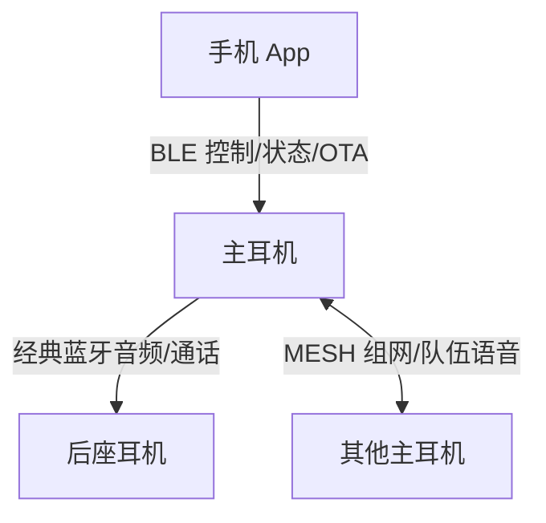

### 4.3 为什么必须双通道

`BLE` 和 `经典蓝牙` 的目标不同：

- `BLE`
  - 低功耗
  - 适合发现设备、绑定、读写配置、传递状态、OTA
- `经典蓝牙`
  - 适合持续音频流
  - 适合通话音频链路
  - 适合作为普通蓝牙耳机接入

复刻这类产品时，推荐使用一颗 `Bluetooth Dual Mode SoC`，同时运行：

- `BLE GATT Server`
- `BR/EDR Audio Profiles`
- `私有 MESH 协议栈`

## 5. 推荐硬件与协议选型

### 5.1 SoC 选型原则

需要满足：

- 双模蓝牙：`BLE + BR/EDR`
- 支持至少：
  - `A2DP`
  - `HFP/HSP`
  - `AVRCP`
- 有可用的音频 DSP 处理能力
- 可同时维护：
  - 手机 BLE 管理连接
  - 后座耳机经典蓝牙连接
  - 主耳机之间的 Mesh 对讲链路

### 5.2 协议角色建议

#### App <-> 主耳机

- 协议：`BLE GATT`
- 角色：
  - App：`Central`
  - 主耳机：`Peripheral`

建议 GATT 服务：

- `Device Info Service`
- `Battery Service`
- `Control Service`
- `Status Service`
- `OTA Service`
- `Mesh Service`
- `Passenger Pairing Service`

#### 主耳机 <-> 后座耳机

- 协议：`经典蓝牙`
- 角色：
  - 主耳机：主动发起连接的一方
  - 后座耳机：被连接的一方

建议能力：

- `HFP/HSP`：双向语音通话
- `A2DP`：如果需要音乐/导航共享
- `AVRCP`：如果需要控制播放状态

#### 主耳机 <-> 主耳机

- 协议：`厂商私有 Mesh`
- 角色：
  - 每个主耳机都是 `Mesh Node`

建议能力：

- 邻居发现
- 入队鉴权
- 音频帧转发
- 路由维护
- 掉线恢复
- 成员列表同步

## 6. 复刻系统的核心设计原则

### 6.1 主耳机是网关，不只是耳机

主耳机必须承担四类职责：

1. `本机音频终端`
2. `App 管理外设`
3. `Mesh 对讲节点`
4. `后座耳机音频网关`

这是整个产品能闭合的前提。

### 6.2 后座耳机是挂靠节点，不是原生 Mesh 节点

如果直接要求普通蓝牙耳机成为 Mesh 成员，会遇到：

- 普通耳机不支持私有 Mesh 协议
- 无法统一升级和管理
- 不同品牌兼容性极差
- 时延和音频质量不可控

因此推荐模型是：

- `主耳机` 进 Mesh
- `后座耳机` 仅连接主耳机
- 主耳机负责把后座语音 `代理进入队伍`

### 6.3 App 只做控制面，不做音频面

不建议让 App 参与音频桥接，原因：

- iOS 对经典蓝牙 App 通信限制较多
- Android 后台音频和蓝牙路由复杂
- 手机参与会引入额外时延和不稳定性
- 断网、锁屏、被系统杀进程都会影响体验

因此推荐：

- `App = 控制面`
- `耳机固件 = 音频面 + 路由面`

## 7. 设备名称与双蓝牙身份模型

从用户视角，系统里可能出现两个名称，例如：

- `BeeBest Q-50756`
- `BeeBest Q-50756-BT`

复刻时建议采用双身份模型：

- `NAME`
  - 作为 BLE 管理身份
  - 给 App 绑定和管理使用
- `NAME-BT`
  - 作为系统级经典蓝牙音频身份
  - 给手机或后座耳机的音频链路使用

这能解释以下现象：

- App 能扫描到管理通道
- 手机系统蓝牙页能看到音频通道
- 同一个物理设备表现为两个逻辑身份

## 8. 前后座对讲实现方案

### 8.1 用户体验目标

用户在 App 中点击“前后座配对”，可以把另一副耳机加入当前主耳机，形成一组前后座对讲单元。

### 8.2 实现流程图

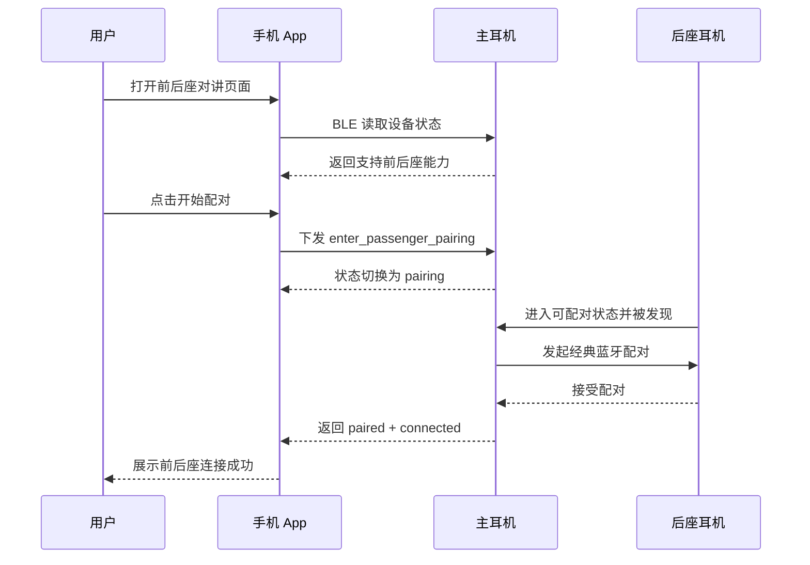

### 8.3 前后座状态机

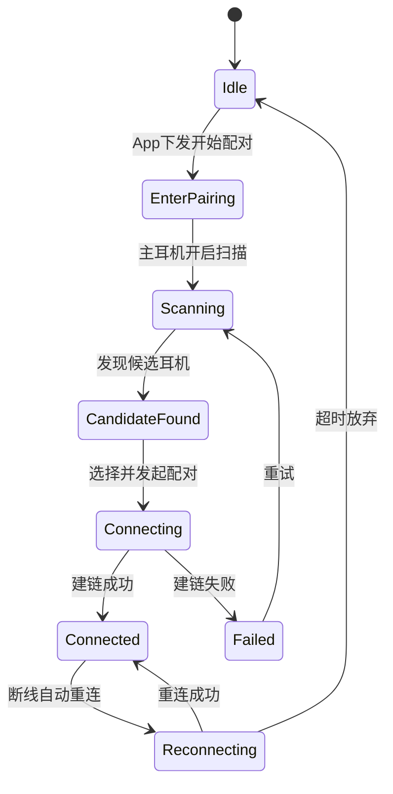

### 8.4 内部音频桥接

主耳机需要在本地维护至少四路音频：

- `Mic_Host`：主耳机骑手麦克风
- `Spk_Host`：主耳机扬声器
- `Mic_Passenger`：后座耳机麦克风上行
- `Spk_Passenger`：后座耳机扬声器下行

推荐的本地双向桥接：

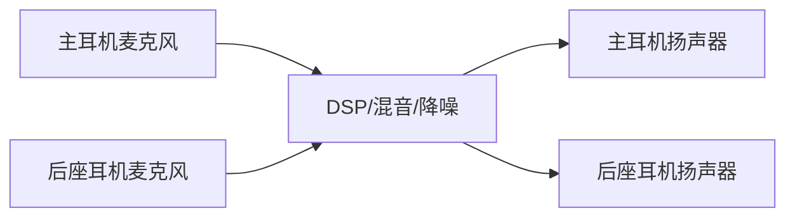

建议处理：

- 风噪抑制
- AEC 回声消除
- AGC 自动增益
- 双工冲突控制
- 侧音管理

## 9. Mesh 组队与多人通话实现方案

### 9.1 用户体验目标

多个主耳机能够加入同一队伍，在无网络环境下进行低时延群聊。

### 9.2 官方约束

公开资料表述：

- `HIVE MESH 2.0`
- `16 人稳定无网通话`

复刻时，应将 `16 人` 作为第一阶段容量目标。

### 9.3 推荐 Mesh 逻辑


实现建议：

- 每个主耳机维护邻居表
- 队伍成员维护逻辑成员表
- 音频帧采用短包广播/转发模型
- 每个节点可作为中继
- 支持弱连接恢复和重路由

### 9.4 入队流程

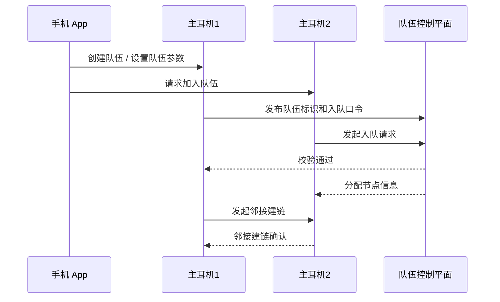

### 9.5 音频分发逻辑

推荐采用 `单发言优先 + 短时冲突仲裁` 模型，原因：

- 降低多人同时说话造成的噪声堆积
- 降低无线带宽压力
- 更容易做稳定体验

最小可行方案：

- `VOX + PTT` 混合模式
- 最近发言者优先
- 在 100~200ms 窗口内做发言仲裁

## 10. 前后座加入群聊的闭合方案

### 10.1 关键结论

“后座耳机也能在队伍里聊天”的合理实现不是让后座耳机直接跑 Mesh，而是：

- 后座耳机连接到主耳机
- 主耳机将后座语音 `注入 Mesh`
- 主耳机将 Mesh 队伍语音 `转发给后座`

### 10.2 拓扑模型

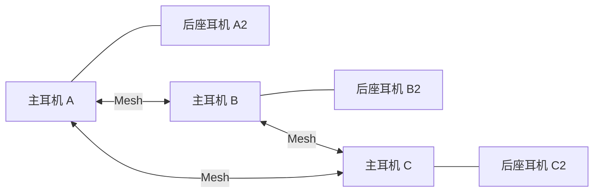

### 10.3 为什么官方的“8 组前后座互联 = 16 人聊天群组”是成立的

因为从系统实现上看：

- `8 台主耳机` 才是 Mesh 节点
- 每台主耳机最多挂 `1 台后座耳机`
- 每个主耳机代理一个后座耳机的上下行语音

因此：

- `8` 个主节点
- `8` 个挂靠节点
- `16` 个用户终端

### 10.4 语音流向

#### 后座说话进入群聊

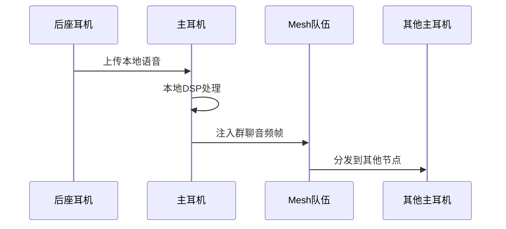

#### 群聊语音下发给后座

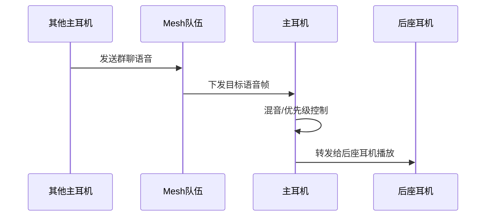

## 11. 音频优先级与混音策略

如果主耳机同时支持：

- Mesh 群聊
- 前后座通话
- 手机来电
- 手机音乐
- 导航播报

则必须定义优先级。推荐：

1. `紧急中断`
   - 低电量
   - 系统故障提示
2. `手机来电`
3. `Mesh 群聊 / 前后座通话`
4. `导航播报`
5. `音乐播放`

建议策略：

- 来电时中断音乐，压低群聊
- 群聊时压低音乐
- 导航播报以 ducking 方式混入
- 前后座私聊和群聊共享通道时，优先保留群聊

## 12. App 侧职责拆分

### 12.1 iOS

推荐使用：

- `CoreBluetooth`
  - 仅负责 BLE 扫描、连接、发现服务、读写特征值、订阅状态

边界说明：

- 不要在 iOS App 中直接实现经典蓝牙耳机对耳机桥接
- 音频和经典蓝牙控制应尽量下沉到耳机固件

### 12.2 Android

推荐使用：

- `BluetoothGatt`
  - 设备管理、绑定、状态同步
- 经典蓝牙 API 仅做辅助调试或配网兜底

边界说明：

- 生产级音频桥接仍应放在耳机固件，而不是手机

### 12.3 App 的最小职责集合

- 扫描主耳机
- 绑定/解绑
- 读取设备状态
- 配置 MESH 参数
- 发起前后座配对
- 展示后座连接列表
- 展示队伍成员列表
- 展示电量/固件版本/角色状态
- 执行 OTA 升级

## 13. 固件侧职责拆分

### 13.1 关键模块

- `BLE Manager`
- `BT Audio Manager`
- `Passenger Pairing Manager`
- `Mesh Manager`
- `Audio Router`
- `DSP Processor`
- `OTA Manager`
- `Persistent Storage`

### 13.2 固件任务模型建议

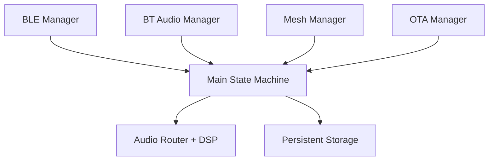

### 13.3 持久化建议

至少存储：

- 主耳机唯一 ID
- 队伍参数
- 后座耳机 bond 信息
- 最近连接设备地址
- 音频配置
- 用户偏好
- 固件版本

## 14. 建议的 BLE GATT 模型

这是一个便于复刻的最小 GATT 设计示例。

### 14.1 Services

- `0xFFF0 Device Control Service`
- `0xFFF1 Mesh Service`
- `0xFFF2 Passenger Pairing Service`
- `0xFFF3 Audio Config Service`
- `0xFFF4 OTA Service`
- `0x180F Battery Service`
- `0x180A Device Information Service`

### 14.2 Characteristics 示例

#### Device Control Service

- `0xFFF0-01 command`
  - 写入控制命令
- `0xFFF0-02 state`
  - Notify 当前状态
- `0xFFF0-03 error_code`
  - Notify 错误信息

#### Mesh Service

- `0xFFF1-01 mesh_role`
- `0xFFF1-02 team_info`
- `0xFFF1-03 member_list`
- `0xFFF1-04 mesh_command`

#### Passenger Pairing Service

- `0xFFF2-01 pairing_state`
- `0xFFF2-02 candidate_list`
- `0xFFF2-03 selected_candidate`
- `0xFFF2-04 pairing_command`

## 15. 命令协议建议

App 与主耳机之间建议采用 TLV 或 CBOR 结构，示例：

```json
{
  "cmd": "enter_passenger_pairing",
  "request_id": "2c2f4f0a",
  "timeout_ms": 30000
}
```

```json
{
  "event": "pairing_candidate_found",
  "items": [
    {
      "id": "dev_01",
      "name": "Passenger-Helmet-01",
      "rssi": -58,
      "profile": "HFP"
    }
  ]
}
```

## 16. 关键状态机建议

### 16.1 主耳机主状态机

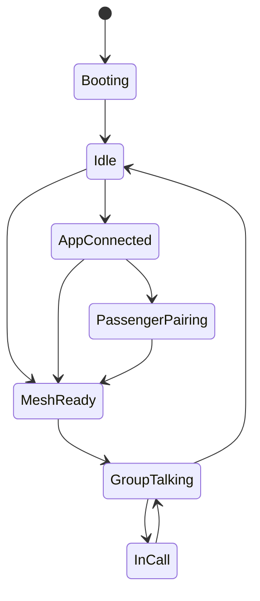

### 16.2 异常恢复状态机

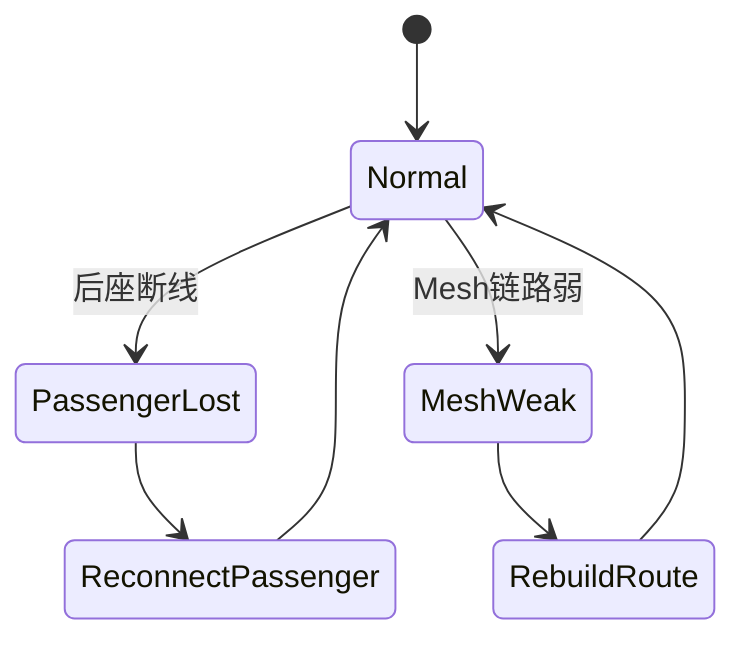

## 17. 容量、时延与稳定性目标

建议设定的第一阶段指标：

- 主 Mesh 节点：`8`
- 总用户终端：`16`
- 前后座接入数：每主耳机 `1`
- 端到端目标时延：`< 200ms`
- 前后座本地通话目标时延：`< 120ms`
- 自动重连时间：`< 5s`

## 18. 兼容性策略

### 18.1 后座耳机兼容性分级

- `A 级`
  - 标准 HFP/HSP 支持良好
- `B 级`
  - 可连但有部分功能缺失
- `C 级`
  - 可发现但不稳定
- `D 级`
  - 不建议支持

### 18.2 建议白名单机制

对于“跨品牌共享 MESH”一类能力，建议维护：

- 已验证兼容设备清单
- 黑名单设备清单
- 按固件版本的兼容矩阵

## 19. 测试方案

### 19.1 功能测试

- App 绑定/解绑
- BLE 重连
- 前后座首次配对
- 前后座自动重连
- 组队/退队
- 8 组前后座并发群聊
- 来电/音乐/导航混音

### 19.2 异常测试

- 骑行中断连
- 单边耳机断电
- 配对中超时
- 同名设备冲突
- Mesh 路由切换
- App 退出或锁屏

### 19.3 音频测试

- 风噪
- 低速/高速骑行
- 双向同时说话
- 音量阶跃
- 麦克风灵敏度差异
- 不同品牌后座耳机兼容

## 20. 风险与工程难点

最难的不是“把设备扫出来”，而是：

- 多协议并发调度
- 本地耳机和 Mesh 的音频桥接
- 群聊与私聊的优先级冲突
- 异构耳机兼容性
- 高移动场景下的弱信号恢复
- 低时延与高稳定性的平衡

## 21. 最小可行版本路线图

### 阶段 1

- 单主耳机 App 绑定
- BLE 管理
- 手机音频配对
- 前后座一对一

### 阶段 2

- 2~4 个主耳机小规模 Mesh
- 单车前后座 + 多车群聊桥接

### 阶段 3

- 扩展到 8 个主耳机
- 支持 8 组前后座
- 完整 16 人群聊

### 阶段 4

- OTA
- 语音指令
- 音效调节
- 自适应降噪
- 灯阵与个性化

## 22. 最终实现摘要

要复刻极蜂这类产品，正确的系统拆法应是：

1. `App` 通过 `BLE` 管理主耳机
2. `主耳机` 通过 `经典蓝牙` 连接后座耳机
3. `主耳机们` 通过 `私有 Mesh` 组成对讲队伍
4. `主耳机` 负责把后座语音桥接进队伍，并把队伍语音转发给后座

这是一套在没有厂商内部协议文档时，仍然能够闭合、可量产、可逐步落地的最佳实践方案。

## 23. 资料来源

- [极蜂对讲 App Store 页面](https://apps.apple.com/cn/app/%E6%9E%81%E8%9C%82%E5%AF%B9%E8%AE%B2/id1662805520)
- [极蜂头盔对讲耳机官网](https://www.ifengyu.com/)
- [BEEBEST 极蜂产品页](https://www.ifengyu.com/home)

## 24. 使用说明

如果你要基于本文档启动项目，建议按下面顺序推进：

1. 先做 `主耳机 BLE 管理 + 手机音频连接`
2. 再做 `主耳机接入后座耳机`
3. 再做 `多主耳机 Mesh`
4. 最后做 `后座耳机代理入群`

这样可以将系统拆成四个可分别验证的里程碑，降低整体风险。
